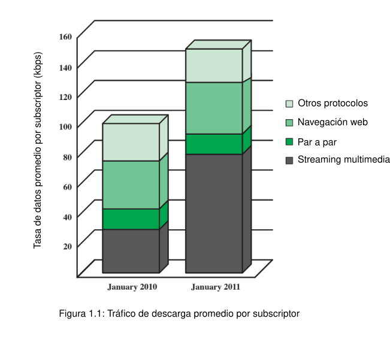
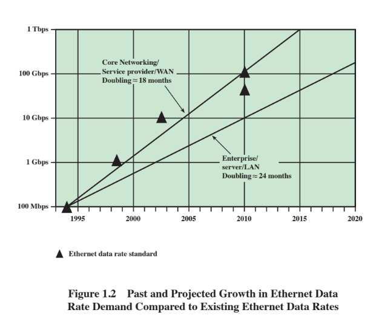
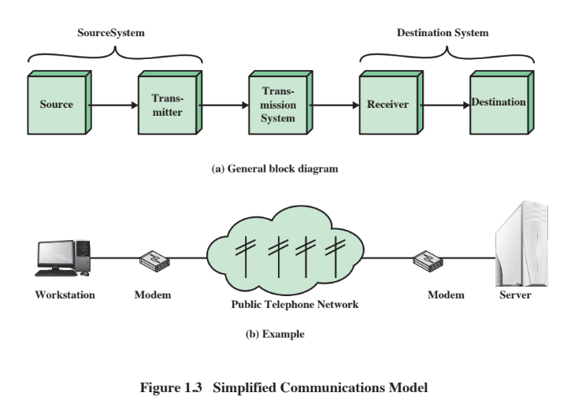
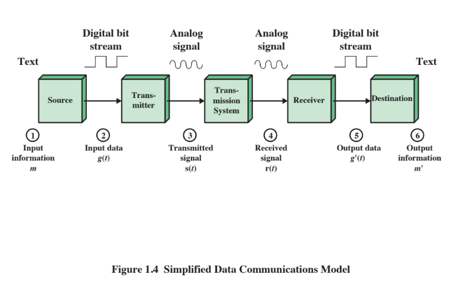

- 10ma edición, por William Stallings
- ## Capítulo 1: Comunicación de datos, Redes de datos y el Internet
	- *"El problema fundamental de la comunicación es aquél de reproducir en un punto, o exacta o aproximadamente, un mensaje seleccionado en otro punto.* - The Mathematical Theory of Communication, Claude Shannon.
	- ### Avances tecnológicos y fuerzas motrices
		- 
	- ## Tendencias notables
		- 
		- ## Cambios en la tecnología de las redes
			- ### Emergen Redes LAN de alta velocidad
				- Los ordenadores personales y los espacios de trabajos se han convertido en una herramienta esencial para trabajadores de oficina.
				- Ejemplos de requerimientos que llaman a redes de alta velocidad
					- Granjas de servidores centralizadas
					- Grupos de trabajo de alto rendimiento
					- Red troncal (backbone) local de alta velocidad
			- ### Necesidad de redes WAN (Wide area network, Red de área amplia)
				- ...
			- ### Aparición de electrónicos digitales de consumo
				- La rápida conversion de los electrónicos de consumo en tecnología digital está teniendo un impacto tanto en el internet como en las intranets corporativas.
				  collapsed:: true
					- Tráfico de imagen y video movido por las redes aumenta dramáticamente
					  collapsed:: true
						- Debido a la grande capacidad de almacenamiento de los  DVDs están siendo incorporados en las páginas web
						- Cámaras de grabación digital han hecho más fácil crear archivos de video digitales para almacenarse en sitios corporativos, así como en internet.
		- ## Convergencia
			- La fusión de la anteriormente separada telefonía, las tecnologías de la información y los negocios implica:
				- Mover la "voz" a una infraestructura de datos
				- Integrar toda la "voz" y las redes de datos dentro de una organización de usuario a una única infraestructura de red de datos.
				- Extensión de la red a la antena inalámbrica
			- La base es la transmisión de datos basada en paquetes usando el Internet Protocol (IP)
			- Aumenta la funcionalidad y el alcance de tanto la infraestructura como la aplicación base
			- ### Capas
				- 
- ## Tabla 1.1: Tareas de comunicación
-
- |      | 
  | :---        |          ---: |
  | Utilización de los sistemas de transmisión      | Direccionamiento   |
  | Interfacing   | Enrutamiento |
  | Generacion de señales | Recuperación |
  | Sincronización | Formateo de mensajes |
  | Administración de los intercambios | Seguridad |
  | Detección y corrección de errores | Administración de redes |
  | Control de flujo |  |
- 
-