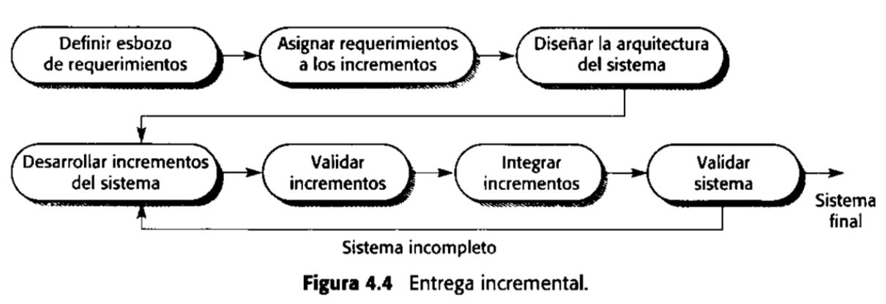

- Los cambios son inevitables en todos los proyectos grandes. Los requerimientos cambian cuando el negocio responde a las presiones externas. Las prioridades de gestión cambian. Cuando se dispone de nuevas tecnologías, cambian los diseños y la implementación. Esto significa que el proceso de software no es un proceso único; más bien, **las actividades del proceso se repiten regularmente conforme el sistema se rehace en respuesta a peticiones de cambios**.
- La esencia de los procesos iterativos es que la **especificación se desarrolla junto con el software**. Sin embargo, esto crea **conflictos con el modelo de obtención** de muchas organizaciones donde **la especificación completa del sistema es parte del contrato de desarrollo del mismo**. En el enfoque incremental, no existe una especificación completa del sistema hasta que el incremento final se especifica. **Esto requiere un nuevo tipo de contrato**, que a los clientes grandes como a las agencias del gobierno les puede ser difícil de incorporar.
- El proceso de software **no es un proceso único**; más bien, las actividades del proceso se repiten regularmente conforme el sistema se rehace en respuesta a peticiones de cambio.
- Estos son dos modelos de procesos que han sido diseñados explícitamente para apoyar la iteración de procesos:
- ## [[Entrega incremental]]
- La especificación, el diseño y la implementación del software se dividen en una serie de incrementos, los cuales se desarrollan por turnos.
- ## [[Desarrollo en espiral]]
- El desarrollo del sistema gira en espiral hacia afuera, empezando con un esbozo inicial y terminando con el desarrollo final del mismo.
- Cada ciclo de la espiral se divide en cuatro sectores:
	- **Definición de objetivos**: Para esta fase del proyecto
		- Se definen los objetivos específicos
		- Se identifican las restricciones del proceso y del producto
		- Se traza un plan detallado de gestión
	- **Evaluación y reducción de riesgos**:
		- Se lleva a cabo un análisis detallado para cada uno de los riesgos del  proyecto identificado.
		- Se definen los pasos para reducir dichos riesgos
	- **Desarrollo y validación**:
		- Después de la evaluación de riesgos, se elige un modelo para el desarrollo del sistema
	- **Planificación**:
		- El proyecto se revisa y se toma la decisión de si se debe continuar con un ciclo posterior de la espiral. Si se decide continuar, se desarrollan los planes para la siguiente fase del proyecto
- >> Un ciclo de la espiral comienza con la elaboración de objetivos, como el rendimiento y la funcionalidad. Entonces se enumeran formas alternativas de aclanzar estos objetivos y las restricciones impuestas en cada una de ellas.
- ## [[Entrega incremental]]
- En un proceso de desarrollo incremental, los clientes identifican, a grandes rasgos, los servicios que proporcionará el sistema. Identifican que servicios son más importantes y cuáles menos. Se definen varios incrementos en donde cada uno proporciona un subconjunto de la funcionalidad del sistema.
- Una vez que los incrementos del sistema se han identificado, los requerimientos para los servicios que se van a entregar en el primer incremento se definen en detalle, y este se desarrolla.
- 
- El proceso de desarrollo incremental tiene varias ventajas
	- Los clientes no tienen que esperar hasta que el sistema esté completo para sacar provecho
	- Los clientes pueden utilizar los incrementos iniciales como prototipos y obtener experiencia sobre los requerimientos de los incrementos posteriores del sistema
	- Existe un bajo riesgo de un fallo total del proyecto
	- Puesto que los servicios de más alta prioridad se entregan primero, y los incrementos posteriores se integran en ellos, es inevitable que los servicios más importantes del sistema sean a los que se les hagan más pruebas
- ### Desventajas de la Entrega Incremental
- Más que representar el proceso de software como una secuencia de actividades con retrospectiva de una actividad a otra, se representa como una espiral. Cada ciclo en la espiral representa una fase del proceso de software. Así el ciclo más interno podría referirse a la viabilidad del sistema.