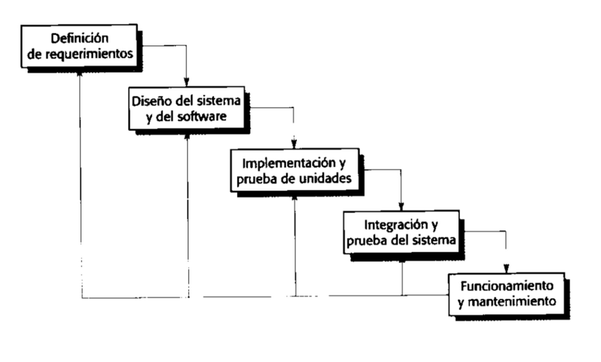

## Modelo en cascada
- El modelo en cascada en el modelamiento de software es una metodología tradicional y secuencial utilizada en el desarrollo de software. Se llama "en cascada" porque implica pasar por una serie de fases de manera lineal y en orden secuencial. Estas fases incluyen la definición de requisitos, el diseño, la implementación, la prueba y el mantenimiento del software. Cada fase debe completarse antes de pasar a la siguiente, lo que significa que no hay retorno a etapas anteriores una vez que se avanza. Aunque este modelo ha sido ampliamente utilizado en el pasado, hoy en día se prefiere utilizar enfoques más flexibles y adaptativos, como los métodos ágiles, que permiten una mayor colaboración y cambios más rápidos durante el proceso de desarrollo de software.
  id:: 64ea600f-c62c-46c3-bcd1-50c292891d7e
- Las principales etapas del modelo en cascada se transforman en actividades fundamentales de desarrollo:
	- 1. **Análisis y definición de requerimientos**: Servicios, restricciones y metas del servicio deben ser definidos. Recavar información y procesos.
		- La etapa más importante
	- 2. **Diseño del sistema y del software**: Divide los requerimientos en sistemas hardware o software. El diseño de software identifica y describe las abstracciones fundamentales del sistema software y sus relaciones.
		- Diagramas: Entender y plasmar los requerimientos
	- 3. **Implementación y prueba de unidades**: El diseño del software se lleva a cabo como un conjunto o unidades de programas.
		- Etapa de desarrollo
	- 4. **Integración y prueba del sistema**: Los programas o las unidades  individuales de programa se integran y prueban como un sistema completo para asegurar que se cumplan los requerimientos del cliente.
		- Etapa en la cual se identifican los fallos del sistema
	- 5. **Funcionamiento y mantenimiento**: El sistema se instala y se pone en funcionamiento práctico.
		- Mantenimiento correctivo del sistema
	- 6. **Despliegue**: Se lleva el sistema a producción
	- **El modelo cascada solo debe usarse cuando los requerimientos se comprendan bien y sea improbable que cambien radicalmente**
	- 
- El primer modelo publicado sobre el proceso de desarrollo de software se derivó a partir de procesos más generales de ingeniería de sistemas (Royce, 1976). Este modelo se ilustra en la figura 2.1. Debido al paso de una fase en cascada a otra, este modelo se conoce como "modelo en cascada" o ciclo de vida del software. El modelo en cascada es un ejemplo de un proceso dirigido por un plan; en principio, se debe planificar y programar todas las actividades del proceso antes de comenzar a trabajar con ellas.
- Las principales etapas del modelo en cascada reflejan directamente las actividades fundamentales del desarrollo:
	- 7. **Análisis y definición de requerimientos**: Los servicios, las restricciones y las metas del sistema se establecen mediante consulta a los usuarios del sistema. Luego, se definen con detalle y sirven como una especificación del sistema.
	- 8. **Diseño del sistema y del software**: El proceso de diseño de sistemas asigna los requerimientos, para sistemas de hardware o de software, al establecer una arquitectura de sistema global. El diseño del software implica identificar y describir las abstracciones fundamentales del sistema de software y sus relaciones.
	- 9. **Implementación y prueba de unidad**: Durante esta etapa, el diseño de software se realiza como un conjunto de programas o unidades del programa. La prueba de unidad consiste en verificar que cada unidad cumpla con su especificación.
	- 10. **Integración y prueba de sistema**: Las unidades del programa o los programas individuales se integran y prueban como un sistema completo para asegurarse de que se cumplan los requerimientos de software. Después de probarlo, se libera el sistema de software al cliente.
	- 11. **Operación y mantenimiento**: Por lo general (aunque no necesariamente), ésta es la fase más larga del ciclo de vida, donde el sistema se instala y se pone en práctica. El mantenimiento incluye corregir los errores que no se detectaron en etapas anteriores del ciclo de vida, mejorar la implementación de las unidades del sistema e incrementar los servicios del sistema conforme se descubren nuevos requerimientos.
- En principio, el resultado de cada fase consiste en uno o más documentos que se autorizaron (“firmaron”). La siguiente fase no debe comenzar sino hasta que termine la fase previa. En la práctica, dichas etapas se traslapan y se nutren mutuamente de información. Durante el diseño se identifican los problemas con los requerimientos. En la codificación se descubren problemas de diseño, y así sucesivamente. El proceso de software no es un simple modelo lineal, sino que implica retroalimentación de una fase a otra. Entonces, es posible que los documentos generados en cada fase deban modificarse para reflejar los  cambios que se realizan.
- Debido a los costos de producción y aprobación de documentos, las iteraciones suelen ser onerosas e implicar un rediseño significativo. Por lo tanto, después de un pequeño número de iteraciones, es normal detener partes del desarrollo, como la especificación, y continuar con etapas de desarrollo posteriores. Los problemas se dejan para una resolución posterior, se ignoran o se programan. Este freno prematuro de los requerimientos quizá signifique que el sistema no hará lo que el usuario desea. También podría conducir a sistemas mal estructurados conforme los problemas de diseño se evadan con la implementación de trucos.
- Durante la fase final del ciclo de vida (operación y mantenimiento), el software se pone en servicio. Se descubren los errores y las omisiones en los requerimientos originales del software. Surgen los errores de programa y diseño, y se detecta la necesidad de nueva funcionalidad. Por lo tanto, el sistema debe evolucionar para mantenerse útil. Hacer tales cambios (mantenimiento de software) puede implicar la repetición de etapas anteriores del proceso.
- #### Ejemplo
	- Un ejemplo del proceso de desarrollo formal, diseñado originalmente por IBM, es el proceso de cuarto limpio (cleanroom). En el proceso de cuarto limpio, cada incremento de software se especifica formalmente y tal especificación se transforma en una implementación. La exactitud del software se demuestra mediante un enfoque formal. No hay prueba de unidad para defectos en el proceso y la prueba del sistema se enfoca en la valoración de la fiabilidad del sistema.
	- El objetivo del proceso de cuarto limpio es obtener un software con cero defectos, de modo que los sistemas que se entreguen cuenten con un alto nivel de fiabilidad.
-
- El modelo en cascada es consecuente con otros modelos del proceso de ingeniería y en cada fase se produce documentación. Esto hace que el proceso sea visible, de modo que los administradores monitoricen el progreso contra el plan de desarrollo. Su principal problema es la partición inflexible del proyecto en distintas etapas. Tienen que establecerse compromisos en una etapa temprana del proceso, lo que dificulta responder a los requerimientos cambiantes del cliente.
- En principio, el modelo en cascada sólo debe usarse cuando los requerimientos se entiendan bien y sea improbable el cambio radical durante el desarrollo del sistema. Sin embargo, el modelo en cascada refleja el tipo de proceso utilizado en otros proyectos de ingeniería. Como es más sencillo emplear un modelo de gestión común durante todo el proyecto, aún son de uso común los procesos de software basados en el modelo en cascada.
- Una variación importante del modelo en cascada es el desarrollo de sistemas formales, donde se crea un modelo matemático para una especificación del sistema. Después se corrige este modelo, mediante transformaciones matemáticas que preservan su consistencia en un código ejecutable. Con base en la suposición de que son correctas sus transformaciones matemáticas, se puede aseverar, por lo tanto, que un programa generado de esta forma es consecuente con su especificación.
- Los procesos formales de desarrollo, como el que se basa en el método B (Schneider,2005; Wordsworth, 1996) son muy adecuados para el desarrollo de sistemas que cuenten con rigurosos requerimientos de seguridad, fiabilidad o protección. El enfoque formal simplifica la producción de un caso de protección o seguridad. Esto demuestra a losclientes o reguladores que el sistema en realidad cumple sus requerimientos de protección o seguridad.
- Los procesos basados en transformaciones formales se usan por lo general sólo en el desarrollo de sistemas críticos para protección o seguridad. Requieren experiencia especializada. Para la mayoría de los sistemas, este proceso no ofrece costo/beneficio significativos sobre otros enfoques en el desarrollo de sistemas.