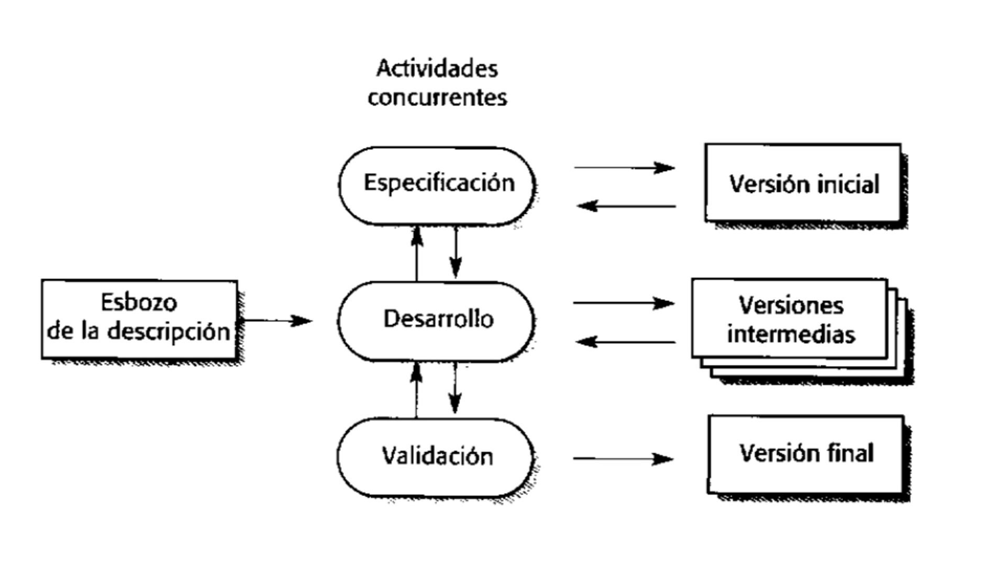

## Desarrollo evolutivo
-
- El desarrollo evolutivo en el modelamiento de software se refiere a la metodología o enfoque que busca **mejorar y adaptar continuamente un sistema de software** a lo largo del tiempo. En lugar de seguir un enfoque de desarrollo tradicional en etapas lineales, el desarrollo evolutivo se centra en la **iteración y la mejora constante del sistema**. En este enfoque, se construye una versión inicial del software para satisfacer los requisitos iniciales y luego se realizan mejoras basadas en la retroalimentación de los usuarios y las necesidades cambiantes del negocio. A medida que se obtiene más información y se detectan áreas de mejora, se realizan nuevos desarrollos o modificaciones en el sistema, creando así versiones mejoradas y evolucionadas.
  id:: 66ea60ae-e8a1-402b-8ba3-107f0e86bc16
- El objetivo del desarrollo evolutivo es lograr un software que se ajuste de manera óptima a las **necesidades cambiantes** de los usuarios y del negocio a lo largo del tiempo. Este enfoque permite una **mayor flexibilidad, adaptabilidad y capacidad de respuesta a los cambios** y retos que surjan a lo largo del ciclo de vida del software.
- Existen dos tipos de desarrollo evolutivo:
	- 2. *Desarrollo exploratorio:* El objetivo del proceso es trabajar con el cliente para explorar sus requerimientos y entregar un sistema final.
	- 3. *Prototipos desechables:* El objetivo es comprender los requerimientos del clientes y entonces desarrollar una definición mejorada de los requerimientos del sistema.
- Desde el punto de vista de la ingeniería y de la gestión, el enfoque evolutivo tiene dos problemas
	- *El proceso no es visible:* Los administradores tienen que hacer entregas regulares para medir el progreso.
	  logseq.order-list-type:: number
	- *A menudo los sistemas tienen una estructura deficiente:* Los cambios continuos tienden a corromper la estructura del software.
	  logseq.order-list-type:: number
	- >> El enfoque evolutivo de desarrollo es el mejor para sistemas pequeños y de tamaño medio
	- 