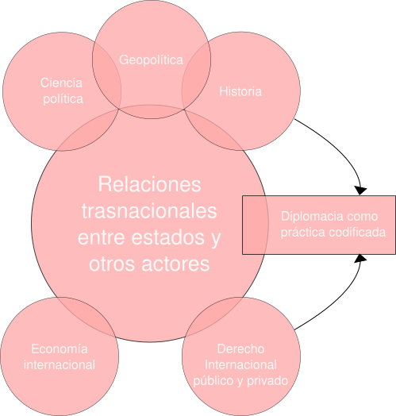

- [[Realismo]]
- [[Neorealismo]]
-
-
- ## Observaciones
- En el mundo actual, es importante desarrollar competencias de análisis en el campo de las Relaciones Internacionales o la Historia de las Relaciones Internacionales. Para lograr esto, debemos vincular datos y teoría con el fin de proponer explicaciones sobre los procesos que ocurren en este ámbito. Al hablar de competencias, nos referimos a la capacidad de evaluar y analizar de manera efectiva. Por lo tanto, las evaluaciones asociadas a estas competencias son de gran importancia para medir nuestro progreso y comprensión en este campo.
- ## Las Relaciones Internacionales en cuanto objeto o área
- Las relaciones internacionales son tanto una práctica política como un objeto de estudio académico. También se les ha conceptualizado como política internacional, política mundial, historia mundial y historia de las relaciones internacionales. Las raíces disciplinarias de este campo son diversas y existen debates en torno a cómo definir y abordar esta disciplina. En resumen, las relaciones internacionales son un objeto de análisis relativamente claro pero con contornos difusos.
- ## Las relaciones internacionales como campo interdisciplinario
- 
- ## La Historia de las Relaciones Internacionales como subcampo de los estudios históricos
	- La historia y las ciencias sociales : Problemas de epistemología y no de “objetos”
	- La historia como “ciencia de lo particular” que estudia la conjunción entre colectivos humanos y tiempo v/s el énfasis comparativo de las ciencias sociales
	- ¿ Cuestiones tendenciales ?
	- De la *historia diplomática* (historia de las relaciones entre estados ) a una historia de procesos  e interacciones complejas mediatizada por la influencia de las ciencias sociales y el propio desarrollo autónomo de la disciplina
- La historia y las ciencias sociales han presentado varios problemas epistemológicos a lo largo del tiempo. La historia se considera una "ciencia de lo particular", ya que estudia la conjunción entre colectivos humanos y el tiempo. Por otro lado, las ciencias sociales se centran en el énfasis comparativo. Sin embargo, han surgido cuestiones tendenciales en este campo. Por ejemplo, ha habido un cambio de enfoque desde la historia diplomática, que se centra en las relaciones entre estados, hacia una historia de procesos e interacciones complejas. Este cambio se ha dado gracias a la influencia de las ciencias sociales y al desarrollo autónomo de la disciplina histórica. Ahora, se entiende que la historia no puede limitarse a estudiar eventos aislados, sino que debe analizar los procesos históricos y las interacciones entre diferentes actores sociales.
  background-color:: gray
  En resumen, la historia y las ciencias sociales han evolucionado para abordar de manera más completa y compleja los fenómenos del pasado, superando el enfoque puramente diplomático. Esto ha permitido un mayor entendimiento de las sociedades y de su desarrollo a lo largo del tiempo.
- Se presentan las conexiones y relaciones entre la historia y las ciencias sociales. Se muestra cómo ambos campos han evolucionado y enriquecido su enfoque a lo largo del tiempo. La historia se considera una "ciencia de lo particular", mientras que las ciencias sociales se centran en el enfoque comparativo. Sin embargo, se han presentado cuestiones tendenciales en este campo.
  
  La influencia de las ciencias sociales y el desarrollo autónomo de la disciplina histórica han llevado a un cambio de enfoque desde la historia diplomática hacia una historia de procesos e interacciones complejas. Ahora se entiende que la historia debe analizar los procesos históricos y las interacciones entre diferentes actores sociales, y no limitarse a estudiar eventos aislados.
  
  Esta evolución ha permitido un mayor entendimiento de las sociedades y su desarrollo a lo largo del tiempo. La historia y las ciencias sociales han superado el enfoque puramente diplomático y se han enfocado en abordar de manera más completa y compleja los fenómenos del pasado.
- # Continuar: PPTX en descargas.
-